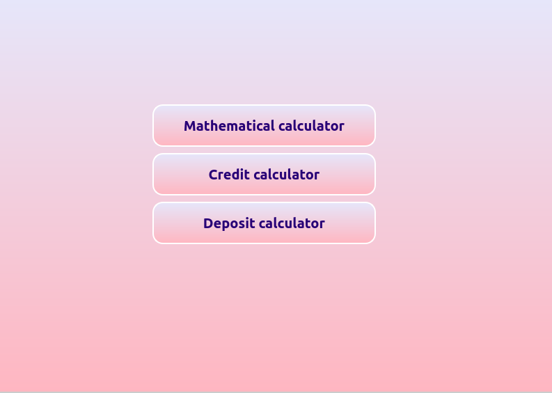
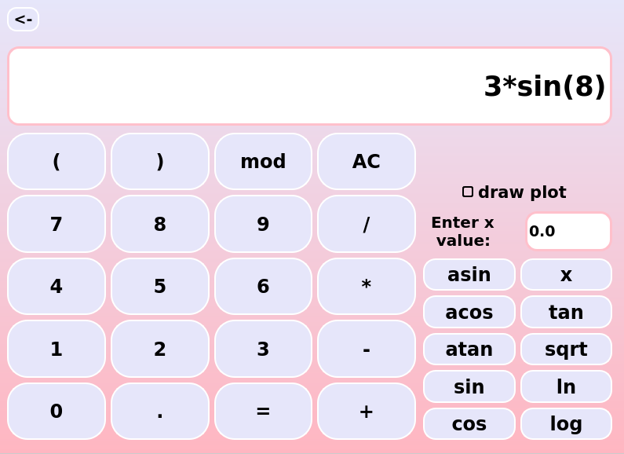
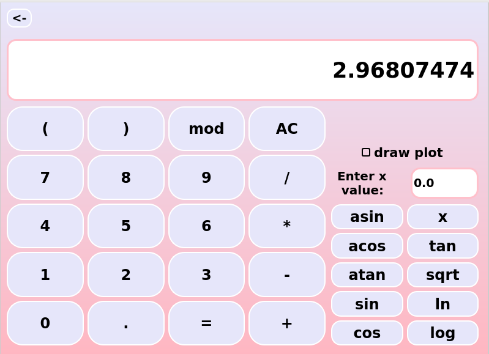
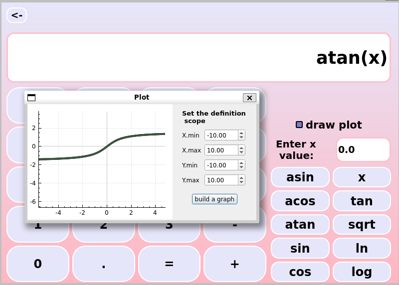
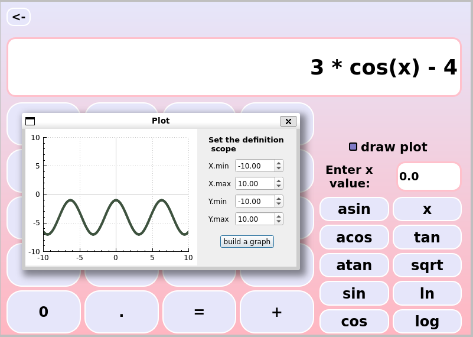
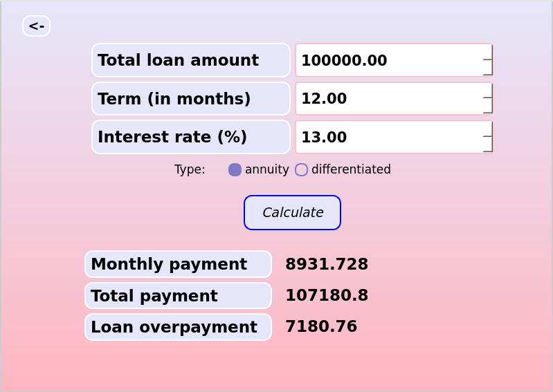
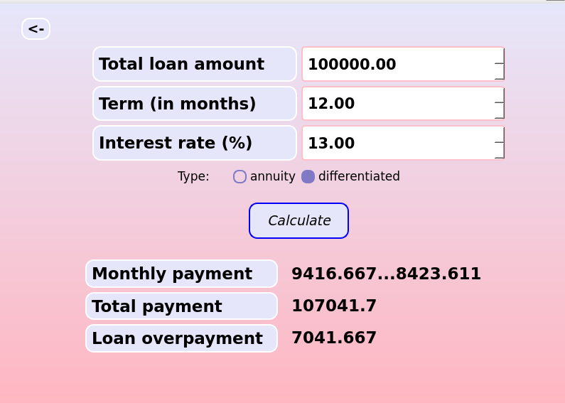
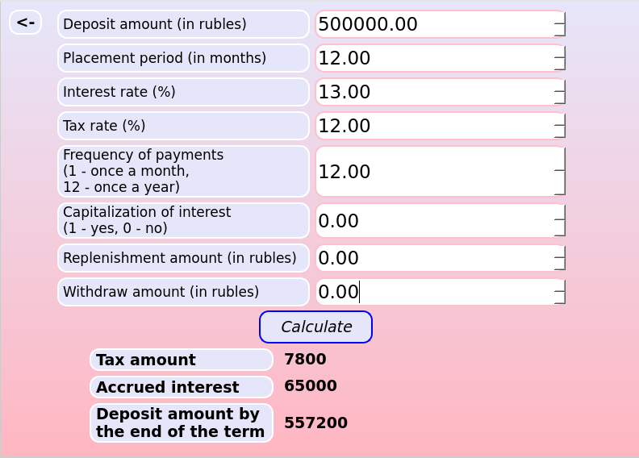
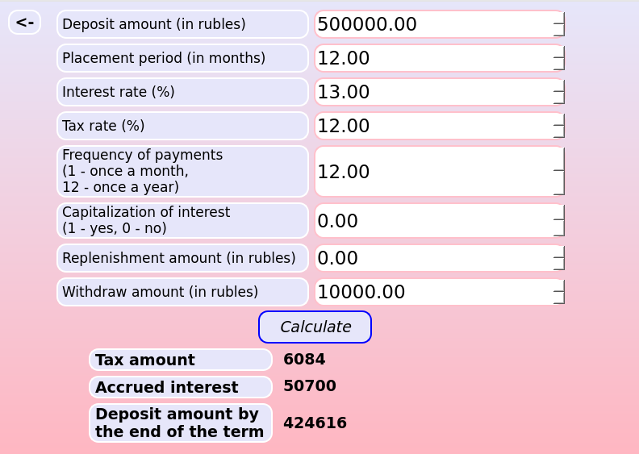

# Calculator
Написание калькулятора на Си с реализацией frontend на C++ QT
## Сборка проекта

1. `cd src` перемещение в директорию src
2. Команды Makefile:
   - `make` / `make all`: Компилирует и запускает проект.
   - `make install`: Собирает приложение и помещает его в папку `../build/`.
   - `make run`: Открывает собранное приложение.
   - `make test`: Компилирует и выполняет тесты.
   - `make gcov_report`: Запускает тесты и генерирует отчет о покрытии кода.
   - `make clean`: Удаляет все временные файлы и результаты сборки.
## Пользовательский интерфейс
- Пользователя встречает меню, в котором он может выбрать тип калькулятора – математический, кредитный и депозитный

- При выборе математического калькулятора пользователь попадает в следющее окно. Вот демонстрация функциональности вычислений

- Результат:

- Также математический калькулятор можно использовать для построения графиков, для этого нужно нажать на квадрат у надписи `draw plot`. Ниже изображена функция арктангенса:

- Также можно ввести другое выражние, например `3*cos(x) -4`

- При выборе на странице меню кредитного калькулятора пользователю отобразится следующее окно. Здесь можно проводить вычисления платежа по кредиту. Изначально выбран аннуитентный платеж.

- Нажав на кружок у надписи `diffirentiated` можно расчитать дифференцированный платеж

- Если пользователь в меню выберет депозитный калькулятор, то ему отобразится следующее окно:

- Возможен расчет с пополнениями и снятиями

## Функционал проекта 
### Математический калькулятор
#### Операторы
- Скобки: `(+ a b)`  
- Сложение: `+ a b`  
- Вычитание: `- a b`  
- Умножение: `* a b`  
- Деление: `/ a b`  
- Возведение в степень: `^ a b`  
- Остаток от деления: `mod a b`  
- Унарный плюс: `+a`  
- Унарный минус: `-a`  
#### Функции
- Косинус: `cos(x)`
- Синус: `sin(x)`
- Тангенс: `tan(x)`
- Арккосинус: `acos(x)`
- Арксинус: `asin(x)`
- Арктангенс: `atan(x)`
- Квадратный корень: `sqrt(x)`
- Натуральный логарифм: `ln(x)`
- Десятичный логарифм: `log(x)`
### Кредитный калькулятор
- Вход: общая сумма кредита, срок, процентная ставка, тип (аннуитетный, дифференцированный);
- Выход: ежемесячный платеж, переплата по кредиту, общая выплата.
### Депозитный калькулятор
- Вход: сумма вклада, срок размещения, процентная ставка, налоговая ставка, периодичность выплат, капитализация процентов, список пополнений, список частичных снятий;
- Выход: начисленные проценты, сумма налога, сумма на вкладе к концу срока.
